# Triển khai Kubernetes
### Yêu cầu:
- Triển khai được Kubernetes thông qua công cụ minikube trên 1 node: 0.5 điểm
Hoặc
- Triển khai được Kubernetes thông qua công cụ kubeadm hoặc kubespray lên 1 master node VM + 1 worker node VM: 1 điểm
### Output

1. **Cài đặt Docker, kubeadm, kubelet và kubectl**
   
```
curl -fsSL https://get.docker.com -o get-docker.sh
sudo sh get-docker.sh
sudo apt-get update
sudo apt-get install -y apt-transport-https ca-certificates curl gpg
curl -fsSL https://pkgs.k8s.io/core:/stable:/v1.30/deb/Release.key | sudo gpg --dearmor -o /etc/apt/keyrings/kubernetes-apt-keyring.gpg
echo 'deb [signed-by=/etc/apt/keyrings/kubernetes-apt-keyring.gpg] https://pkgs.k8s.io/core:/stable:/v1.30/deb/ /' | sudo tee /etc/apt/sources.list.d/kubernetes.list
sudo apt-get update
sudo apt-get install -y kubelet kubeadm kubectl
sudo apt-mark hold kubelet kubeadm kubectl
sudo systemctl enable --now kubelet
```
2. **Tắt swap, fix container**
```
sudo swapoff -a && sudo sed -i '/swap/d' /etc/fstab
mkdir -p /etc/containerd
containerd config default > /etc/containerd/config.toml
systemctl restart containerd
```
3. **Khởi tạo cluster**
```
sudo kubeadm init --apiserver-advertise-address=192.168.0.176
add flannel addon
kubectl apply -f 
```

4. **Join master node**

```
kubeadm join 192.168.0.176:6443 --token l92gd8.fzeg4kgs2sz1ju1a --discovery-token-ca-cert-hash sha256:1a35af24fa97a00c96ffee838b4b2ff9c0f4ea0a92037eeeeb70ceebb57f7201
https://secret.ist.ie/r/6669669b831d23@07059097
```

7. **Kiểm tra**


# Triển khai web application sử dụng các DevOps tools & practices
## K8S Helm Chart
### Yêu cầu 1:
- Cài đặt ArgoCD lên Kubernetes Cluster, expose được ArgoCD qua NodePort
- Trong trường hợp sử dụng cụm Lab trên Viettel Cloud, cài đặt Loadbalancer lên Bastion Node thông qua công cụ docker-compose, expose port ArgoCD ra môi trường public thông qua một trong số các port đã được cấp cho từng sinh viên
### Output 1:

1. **Cài đặt Argocd**
```
kubectl apply -f https://raw.githubusercontent.com/argoproj/argo-cd/stable/manifests/install.yaml
```
2. **Kiểm tra**


7. **Giao diện**

### Yêu cầu 2: 
- Viết 2 Helm Chart cho web Deployment và api Deployment, để vào 1 folder riêng trong repo web và repo api
- Tạo 2 Repo Config cho web và api, trong các repo này chứa các file values.yaml với nội dung của cá file values.yaml là các config cần thiết để chạy web và api trên k8s bằng Helm Chart 
- Sử dụng tính năng multiple sources của ArgoCD để triển khai các service web và api service lên K8S Cluster  theo hướng dẫn của ArgoCD, expose các service này dưới dạng NodePort Multiple Sources for an Application - Argo CD - Declarative GitOps CD for Kubernetes
- Trong trường hợp sử dụng cụm Lab trên Viettel Cloud, cài đặt Loadbalancer lên Bastion Node thông qua công cụ docker-compose, expose 2 port của Web ra môi trường public thông qua một trong số các port đã được cấp cho từng sinh viên
### Output 2:
1. **Helm chart web and api and web sidecar (for exporting metrics)**


- web: https://github.com/smugikity/vdt-helm-charts/tree/main/web
- api: https://github.com/smugikity/vdt-helm-charts/tree/main/api
- sidecar: https://github.com/smugikity/vdt-helm-charts/tree/main/nginx-exporter

2. **File manifest with multisources**

web
```
apiVersion: argoproj.io/v1alpha1
kind: Application
metadata:
  name: helm-web
  namespace: default
spec:
  project: default
  syncPolicy:
    automated:
      prune: true
      selfHeal: true
    syncOptions:
      - CreateNamespace=true
  destination:
    server: https://kubernetes.default.svc
    namespace: default
  sources:
    - repoURL: "https://github.com/smugikity/vdt-helm-charts"
      path: web
      targetRevision: HEAD
      helm:
        valueFiles:
          - $values/values.yaml
    - repoURL: "https://github.com/smugikity/vdt-config-web"
      targetRevision: HEAD
      ref: values
```
api
```
apiVersion: argoproj.io/v1alpha1
kind: Application
metadata:
  name: helm-api
  namespace: default
spec:
  project: default
  syncPolicy:
    automated:
      prune: true
      selfHeal: true
    syncOptions:
      - CreateNamespace=true
  destination:
    server: https://kubernetes.default.svc
    namespace: default
  sources:
    - repoURL: "https://github.com/smugikity/vdt-helm-charts"
      path: api
      targetRevision: HEAD
      helm:
        valueFiles:
          - $values/values.yaml
    - repoURL: "https://github.com/smugikity/vdt-config-api"
      targetRevision: HEAD
      ref: values
```
- manifest files: https://github.com/smugikity/vdt-helm-charts/tree/main/agro-manifests
- web config repo: https://github.com/smugikity/vdt-config-web
- api config repo: https://github.com/smugikity/vdt-config-api

3. **Argocd UI**
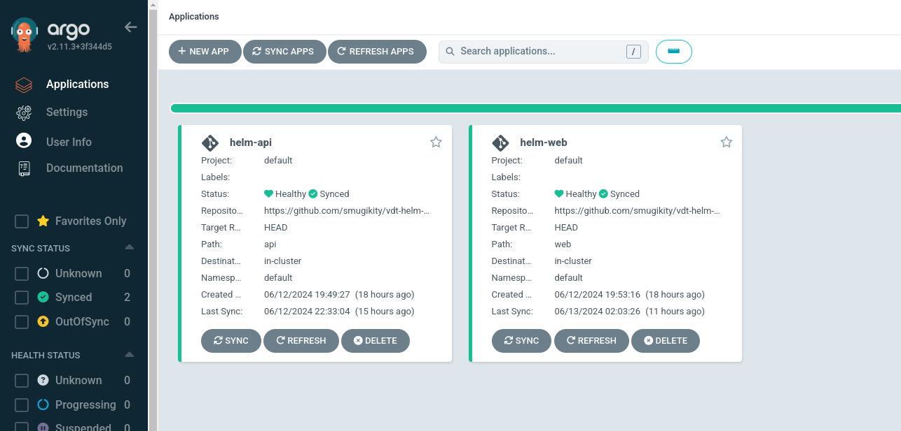
4. **Application**
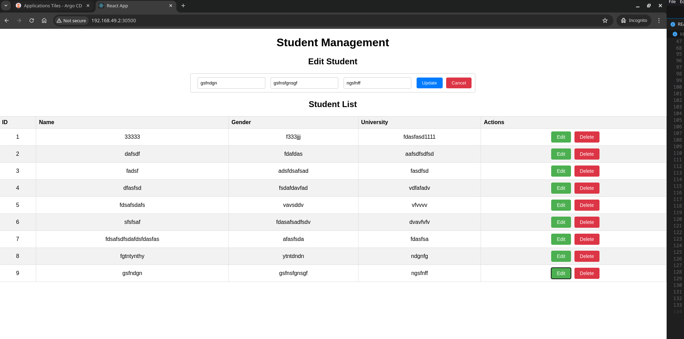
## Continuous Delivery 
### Yêu cầu:
- Viết 2 luồng CD cho 2 repo web và api, khi có 1 tag mới được tạo ra trên trên 1 trong 2 repo này thì luồng deploy tương ứng của repo đó thực hiện các công việc sau:
    - Build docker image với image tag là tag name đã được tạo ra trên gitlab và push docker image sau khi build xong lên Docker Hub
    - Sửa giá trị Image version trong file values.yaml  trong config repo và push thay đổi lên config repo. Tham khảo: https://stackoverflow.com/a/72696837
- Cấu hình ArgoCD tự động triển khai lại web Deployment và api Deployment khi có sự thay đổi trên config repo.
### Output:
1. **Github workflow file**
```
name: CI/CD Pipeline

on:
  push:
    tags:
      - 'v*'
jobs:
...
  build-and-push-docker:
    runs-on: ubuntu-latest
    needs: build-and-test
    steps:
      - name: Checkout repository
        uses: actions/checkout@v4
      - name: Set up Docker Buildx
        uses: docker/setup-buildx-action@v3
      - name: Log in to Docker Hub
        uses: docker/login-action@v3
        with:
          username: ${{ secrets.DOCKER_USERNAME }}
          password: ${{ secrets.DOCKER_PASSWORD }}
      - name: Build and push Docker image
        run: |
          tag=${GITHUB_REF#refs/tags/}
          username=${{ secrets.DOCKER_USERNAME }}
          docker build -t $username/vie-front:$tag .
          docker push $username/vie-front:$tag
  change-image-tag:
    runs-on: ubuntu-latest
    needs: build-and-push-docker
    environment: ci
    permissions:
      contents: write
      pull-requests: write 
      issues: write
    env:
      TAG: ${GITHUB_REF#refs/tags/}
    steps:
      - uses: actions/checkout@v4
        name: Change the deployment of git repo
        with:
          repository: smugikity/vdt-config-web
          token: ${{ secrets.GIT_TOKENN }}
          ref: main
      - name: Change image tag
        run: |
          TAG="${GITHUB_REF#refs/tags/}"
          echo $TAG
          echo “Working Directory: $(pwd)”
          sed -i "s/^ *tag:.*$/  tag: $TAG/" values.yaml
      - name: Publish new image
        run: |
          git config user.email github-actions@github.com
          git config user.name github-actions
          git add values.yaml
          git commit -m "Update image tag, manifest: ${{ github.run_number }}"
          git push 
```
- api workflow: https://github.com/smugikity/vie-back/tree/main/.github/workflows
- web workflow: https://github.com/smugikity/vie-front/tree/main/.github/workflows

2. **Github Action in action :o**

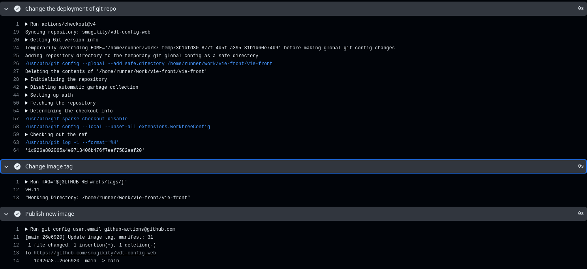
3. **Commits from config repo**

4. **Dockerhub repo**
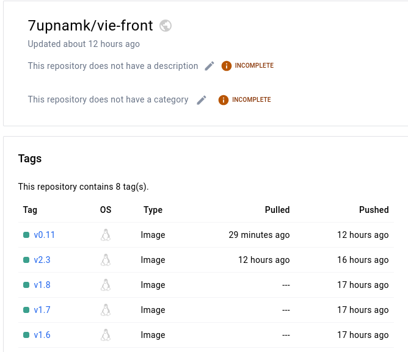
5. **Automated sync on Argocd**
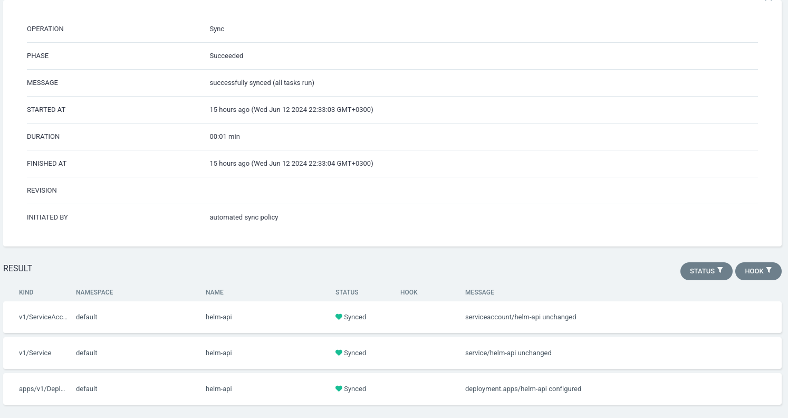
## Monitoring
### Yêu cầu:
- Expose metric của web service và api service ra 1 http path.
- Triển khai Prometheus lên Kubernetes Cluster thông qua Prometheus Operator, phơi ra ngoài dưới dạng NodePort: 
- Expose Prometheus dưới dạng Nodeport
- Trong trường hợp sử dụng cụm lab của Viettel Cloud, tạo 1 load balancer với backend là NodePort Service của Prometheus, để expose Prometheus UI ra Public Internet 
- Sử dụng Service Monitor của Prometheus Operator để giám sát Web Deployment và API Deployment
### Output:
1. **Install and expose Prometheus operator**

https://github.com/prometheus-operator/prometheus-operator/releases/download/v0.74.0/bundle.yaml
```
kubectl apply -f bundle.yaml
...
kubectl patch svc prometheus-operated -p '{"spec": {"type": "NodePort"}}'
```
2. **Metric api**
 
```
from prometheus_client import Counter, Gauge, generate_latest
...
CONTENT_TYPE_LATEST = str('text/plain; version=0.0.4; charset=utf-8')
number_of_requests = Counter(
    'number_of_requests',
    'The number of requests, its a counter so the value can increase or reset to zero.'
)

current_memory_usage = Gauge(
    'current_memory_usage_locally',
    'The current value of memory usage, its a gauge so it can go up or down.',
    ['server_name']
)

@app.route('/metrics', methods=['GET'])
def get_data():
    """Returns all data as plaintext."""
    number_of_requests.inc()
    current_memory_usage.labels('server-a').set(random.randint(10000,90000))
    return Response(generate_latest(), mimetype=CONTENT_TYPE_LATEST)

return app
```
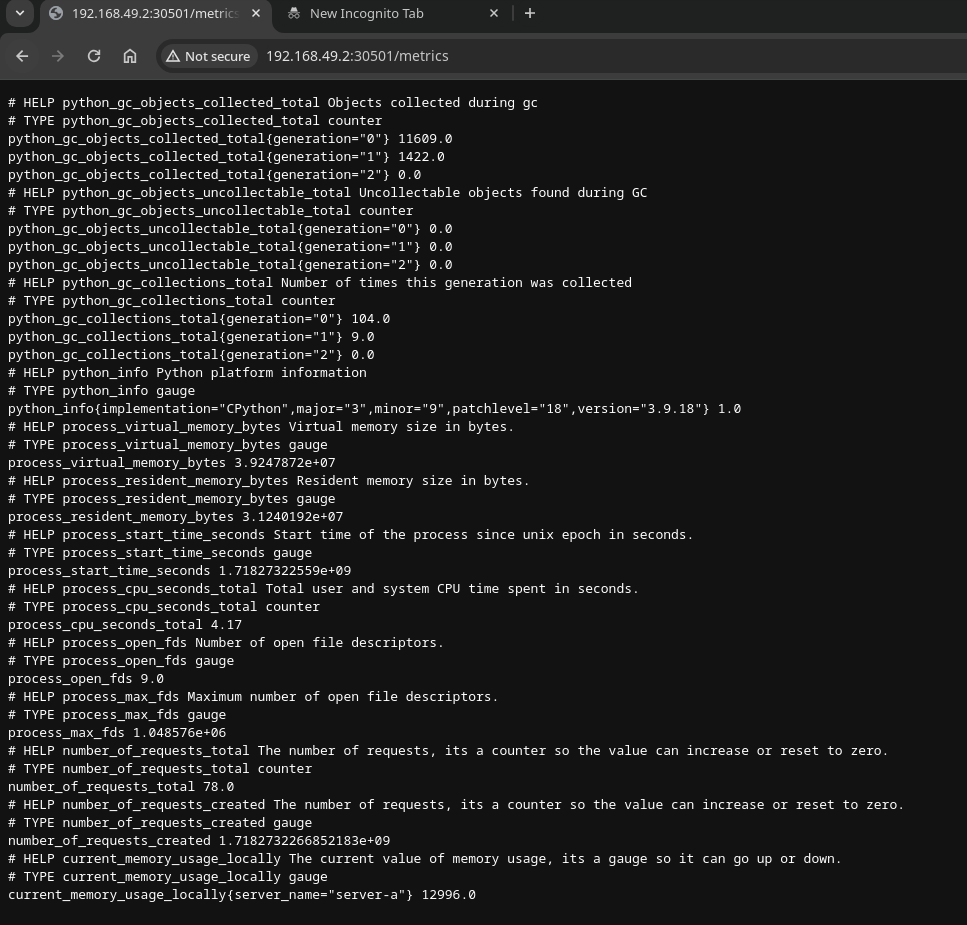
3. **Metric web**
Nginx prometheus exporter helm values
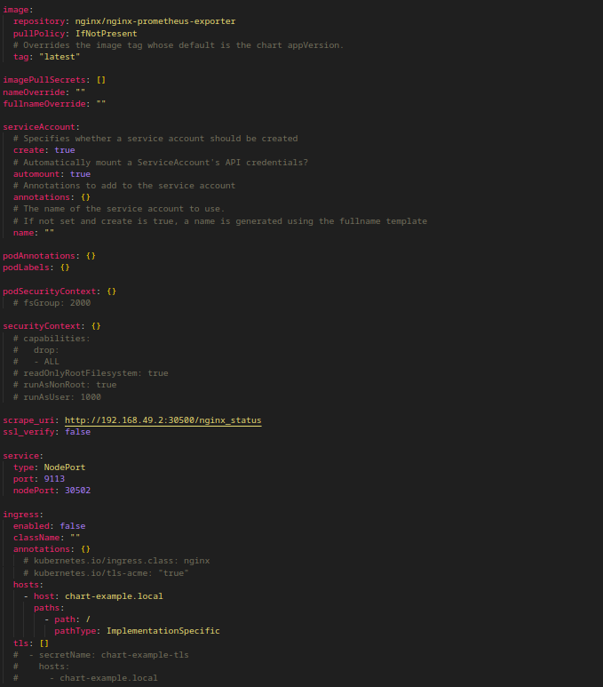
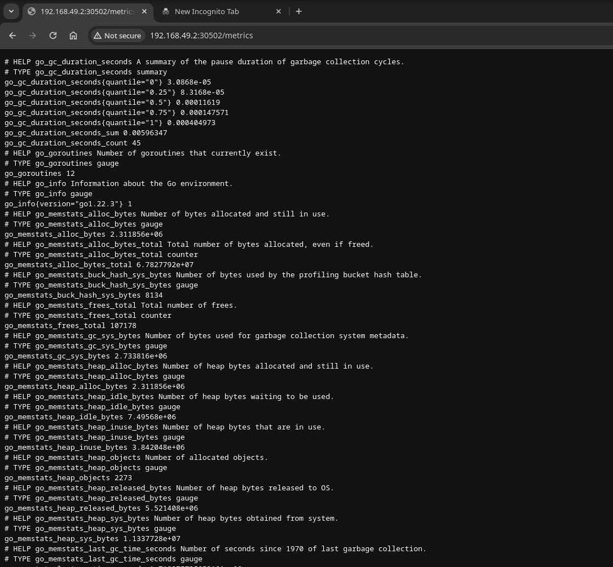
4. **Service monitor**

api
```
apiVersion: monitoring.coreos.com/v1
kind: ServiceMonitor
metadata:
  name: helm-api-monitor  
  labels:
    app: vdt
spec:
  selector:
    matchLabels:
      app.kubernetes.io/managed-by: Helm
      app.kubernetes.io/name: api
  namespaceSelector:
    matchNames:
    - default  
  endpoints:
  - port: http  
    path: /metrics  
    interval: 30s 
```
web (nginx exporter)
```
apiVersion: monitoring.coreos.com/v1
kind: ServiceMonitor
metadata:
  name: helm-web-monitor 
  labels:
    app: vdt
spec:
  selector:
    matchLabels:
      app.kubernetes.io/managed-by: Helm
      app.kubernetes.io/name: nginx-exporter
  namespaceSelector:
    matchNames:
    - default  
  endpoints:
  - port: http  
    path: /metrics  
    interval: 30s 
```

- prometheus config files: https://github.com/smugikity/vdt-helm-charts/tree/main/prometheus 

5. **Result**

## Logging
### Yêu cầu:
- Sử dụng Kubernetes DaemonSet triển khai fluentd hoặc fluentbit lên kubernetes đẩy log của các Deployment Web Deployment và API Deployment lên cụm ElasticSearch tập trung với prefix index dưới dạng tên_sinh_viên_viết_tắt_sdt: Ví dụ: conghm_012345678
### Output:
1. **Fluentd config**
```
apiVersion: v1
kind: ConfigMap
metadata:
  name: fluentd-config
  namespace: default
data:
  fluent.conf: |
    <label @FLUENT_LOG>
      <match fluent.**>
        @type null
        @id ignore_fluent_logs
      </match>
    </label>
    <source>
      @type tail
      @id in_tail_container_logs
      path /var/log/containers/*helm*.log
      pos_file /var/log/fluentd.log.pos
      tag kubernetes.*
      read_from_head true
      <parse>
        @type json
        time_key time
        time_format %Y-%m-%dT%H:%M:%S.%L%z
        keep_time_key true
      </parse>
    </source>
    <filter kubernetes.**>
      @type kubernetes_metadata
    </filter>
    <filter kubernetes.**>
      @type record_transformer
      enable_ruby true
      <record>
        master_url ${record["kubernetes"]["master_url"]}
      </record>
      remove_keys stream,time,docker,kubernetes
    </filter>
    <match kubernetes.**>
      @type             elasticsearch
      @log_level        debug
      include_tag_key   false
      host              116.103.226.146
      port              9200
      scheme            https
      ssl_verify        false
      user              elastic
      password          iRsUoyhqW-CyyGdwk6V_
      logstash_format   true
      logstash_prefix   tuan_79219430423
      reload_connections true
      reconnect_on_error true
      reload_on_failure true
      request_timeout 20s
      <buffer>
        flush_interval 10s
      </buffer>
    </match>
```


- fluentd config files: https://github.com/smugikity/vdt-helm-charts/tree/main/fluentd

2. **Kibana result**

filter by /metric path 
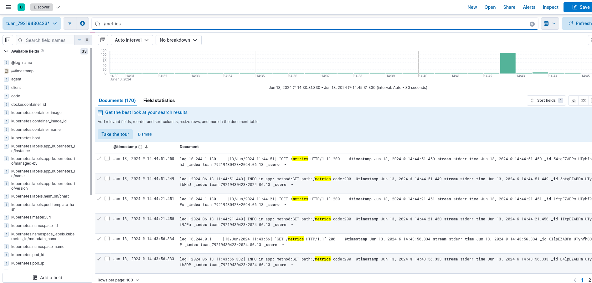

## Security
### Yêu cầu 1: 
- Dựng HAProxy Loadbalancer trên 1 VM riêng (trong trường hợp cụm lab riêng của sinh viên) hoặc trên Basion Node (trường hợp sử dụng cụm Lab của Viettel Cloud) với mode TCP, mở 2 port web_port và api_port trên LB trỏ đến 2 NodePort của Web Deployment và API Deployment trên K8S Cluster. (0.5)
- Sử dụng 1 trong 2 giải pháp Ingress, hoặc haproxy sidecar container cho các deployment, đảm bảo các truy cập đến các port web_port và api_port sử dụng https (0.5)
- Cho phép sinh viên sử dụng self-signed cert để làm bài
### Output 1:
1. **Install haproxy**
```
sudo apt install haproxy
```
config file /etc/haproxy/haproxy.cfg
```
global
    log /dev/log    local0
    log /dev/log    local1 notice
    chroot /var/lib/haproxy
    stats socket /run/haproxy/admin.sock mode 660 level admin
    stats timeout 30s
    user haproxy
    group haproxy
    daemon
defaults
    log     global
    mode    tcp
    option  tcplog
    option  dontlognull
    timeout connect 5000ms
    timeout client  50000ms
    timeout server  50000ms
frontend flask-fe
    bind *:8000
    default_backend flask-be
backend flask-be
    balance roundrobin
    server backend1 192.168.49.2:30501 check
frontend react-fe
    bind *:8001
    default_backend react-be
backend react-be
    balance roundrobin
    server backend1 192.168.49.2:30500 check
```
haproxy ip


2. **Install nginx ingress**
```
kubectl apply -f https://raw.githubusercontent.com/kubernetes/ingress-nginx/main/deploy/static/provider/baremetal/deploy.yaml
```
Create self signed cert and host name
```
openssl genrsa -out tls.key 2048
openssl req -new -key tls.key -out tls.csr -subj "/CN=my-service"
openssl x509 -req -days 365 -in tls.csr -signkey tls.key -out tls.crt
kubectl create secret tls my-tls-secret --cert=tls.crt --key=tls.key
echo "192.168.49.2    api.vdt.arpa web.vdt.arpa" | sudo tee -a /etc/hosts
```
Create ingress api
```
apiVersion: networking.k8s.io/v1
kind: Ingress
metadata:
  name: api
spec:
  ingressClassName: nginx
  rules:
  - host: api.vdt.arpa
    http:
      paths:
      - backend:
          service:
            name: helm-api
            port:
              number: 5000
        path: /
        pathType: Prefix
  tls:
  - hosts:
    - api.vdt.arpa
    secretName: my-tls-secret
```
Create ingress web
```
apiVersion: networking.k8s.io/v1
kind: Ingress
metadata:
  name: web
spec:
  ingressClassName: nginx
  rules:
  - host: web.vdt.arpa
    http:
      paths:
      - backend:
          service:
            name: helm-web
            port:
              number: 80
        path: /
        pathType: Prefix
  tls:
  - hosts:
      - web.vdt.arpa
    secretName: my-tls-secret
```
- ingress nginx config files: https://github.com/smugikity/vdt-helm-charts/tree/main/ingress-nginx

3. **Https access** 
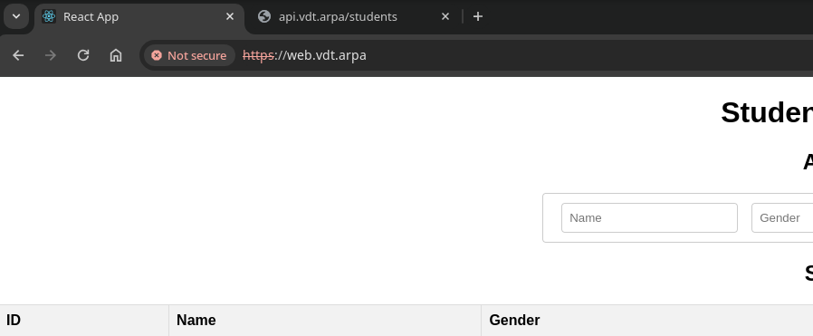
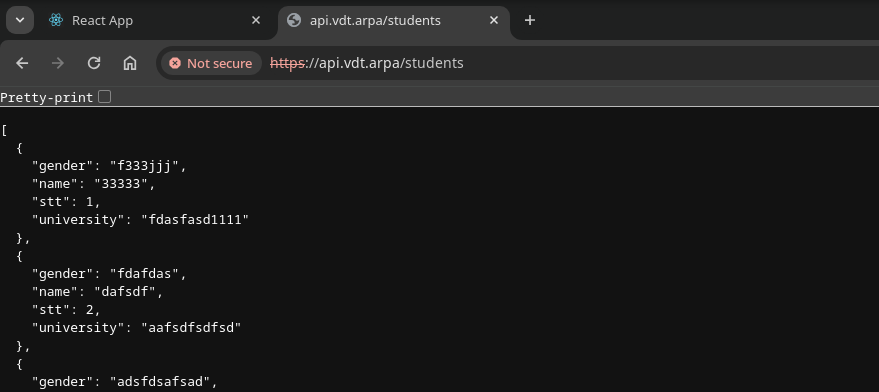
### Yêu cầu 2:
- Đảm bảo 1 số URL của api service  khi truy cập phải có xác thực thông qua 1 trong số các phương thức cookie, basic auth, token auth, nếu không sẽ trả về HTTP response code 403. (0.5)
- Thực hiện phân quyền cho 2 loại người dùng trên API:
  - Nếu người dùng có role là user thì truy cập vào GET request trả về code 200, còn truy cập vào POST/DELETE thì trả về 403
  - Nếu người dùng có role là admin thì truy cập vào GET request trả về code 200, còn truy cập vào POST/DELETE thì trả về 2xx

### Output 2: 
1. **Simple authentication with role-based access control**
```
users = {
    "user1": {
        "username": "user",
        "password": ("user"),  #Shoulda been hashed
        "role": "user"
    },
    "admin": {
        "username": "admin",
        "password": ("admin"),  #Shoulda been hashed
        "role": "admin"
    }
}
def authenticate(username, password):
    user = users.get(username)
    if not user:
        return False
    return (user["password"] == password)
def requires_auth(role="user"):
    def decorator(f):
        @wraps(f)
        def decorated(*args, **kwargs):
            auth = request.authorization  # Get authorization header

            if not auth or not authenticate(auth.username, auth.password):
                abort(401, "Authorization required")

            if role == "admin" and users[auth.username]["role"] != role:
                abort(403, "Admin privileges required")

            return f(*args, **kwargs)
        return decorated
    return decorator
...
@app.route('/students', methods=['GET'])
@requires_auth() #none
def handle_students():
...
@app.route('/students', methods=['POST'])
@requires_auth(role="admin") #require admin
def add_students():
...
@app.route('/students/<_id>', methods=['PUT'])
@requires_auth(role="admin") #require admin
def edit_student(_id):
...
@app.route('/students/<_id>', methods=['DELETE'])
@requires_auth(role="admin") #require admin
def delete_student(_id):
...
```
2. **Results**
Return 401 for anonimously unauthorized access:
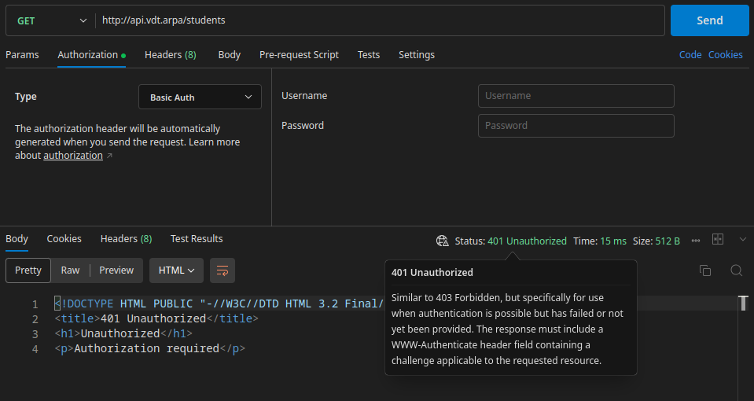
Return 200 for authorized access:
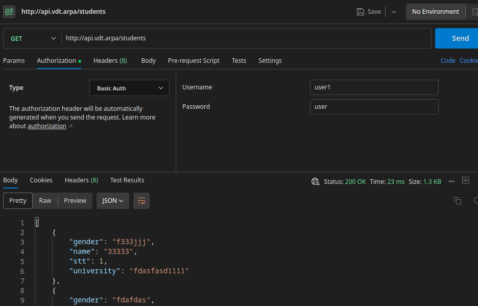
Return 403 for user's unauthorized access:
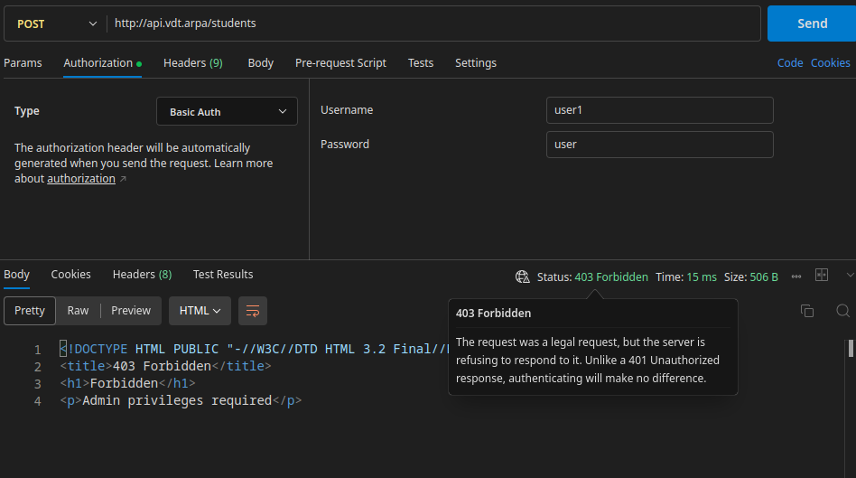
Return 200 for authorized access


### Yêu cầu 3:
- Sử dụng 1 trong số các giải pháp để ratelimit cho Endpoint của api Service, sao cho nếu có  quá 10 request trong 1 phút gửi đến Endpoint của api service thì các request sau đó bị trả về HTTP Response 409 
### Output 3:
1. **Ingress nginx config**
ingress-nginx configmap
```
apiVersion: v1
kind: ConfigMap
metadata:
  name: ingress-nginx-controller
  namespace: ingress-nginx
data:
  limit-req-status-code: "409"
```
configure the api ingress again
```
apiVersion: networking.k8s.io/v1
kind: Ingress
metadata:
  name: api
  annotations:
    nginx.ingress.kubernetes.io/limit-connections: "10" #concurrent connections
    nginx.ingress.kubernetes.io/limit-rps: "0" #p sec
    nginx.ingress.kubernetes.io/limit-rpm: "10" #p min
    nginx.ingress.kubernetes.io/limit-burst-multiplier: "1"
    nginx.ingress.kubernetes.io/limit-exempt: "none"
spec:
  ingressClassName: nginx
  rules:
  - host: api.vdt.arpa
    http:
      paths:
      - backend:
          service:
            name: helm-api
            port:
              number: 5000
        path: /
        pathType: Prefix
  tls:
  - hosts:
    - api.vdt.arpa
    secretName: self-signed-tls
```
- ingress nginx config files: https://github.com/smugikity/vdt-helm-charts/tree/main/ingress-nginx

2. **Testing**
